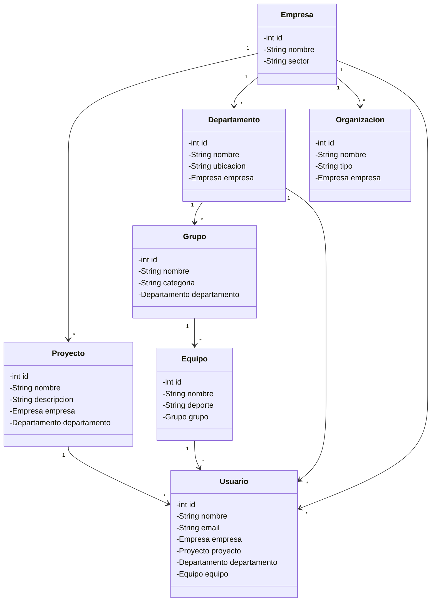

# Proyecto ORM Lite - Gestión de Organizaciones

Este proyecto implementa un sistema de gestión organizacional utilizando **ORMLite** para mapeo objeto-relacional con SQLite.

## Estructura del Proyecto

### Entidades

El proyecto contiene las siguientes entidades interconectadas:



## Relaciones de Entidades

- **Empresa**: Entidad raíz que contiene toda la estructura
  - Tiene múltiples Proyectos
  - Tiene múltiples Departamentos
  - Tiene múltiples Organizaciones
  
- **Departamento**: Pertenece a una Empresa
  - Contiene múltiples Grupos
  
- **Grupo**: Pertenece a un Departamento
  - Contiene múltiples Equipos
  
- **Equipo**: Pertenece a un Grupo
  - Tiene múltiples Usuarios asociados
  
- **Proyecto**: Pertenece a una Empresa y Departamento
  - Tiene múltiples Usuarios asignados
  
- **Usuario**: Entidad que pertenece a:
  - Una Empresa
  - Un Proyecto
  - Un Departamento
  - Un Equipo

## Configuración

### DatabaseConfig
Clase de infraestructura que maneja:
- Conexión a SQLite
- Creación automática de tablas
- Inicialización de DAOs

### Uso

```java
DatabaseConfig dbConfig = new DatabaseConfig();
Dao<Usuario, Integer> usuarioDao = dbConfig.getUsuarioDao();
// ... usar los DAOs
dbConfig.cerrar();
```

## Tecnologías

- **ORMLite**: ORM Java
- **SQLite**: Base de datos
- **Lombok**: Generación automática de getters/setters
- **Maven**: Gestor de dependencias